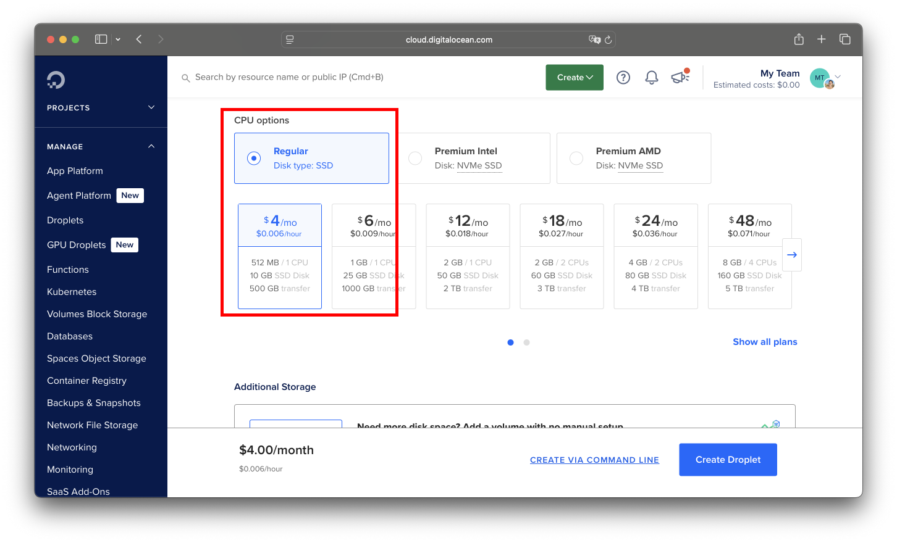
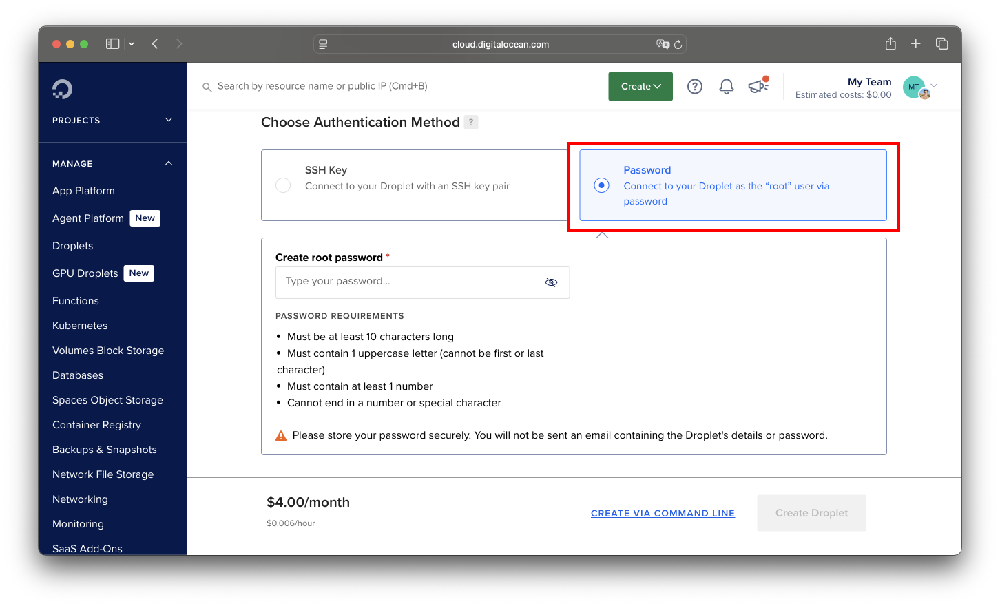
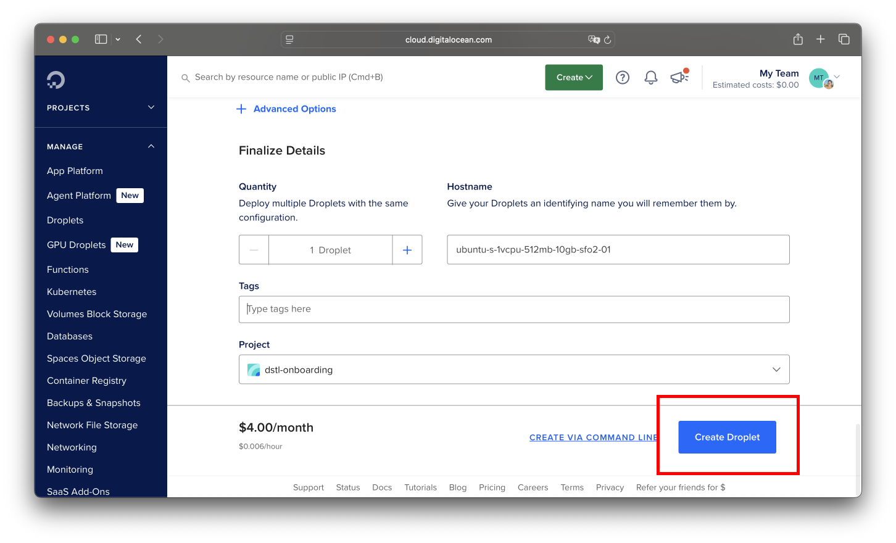

# Week 4: Full-Stack Development

{: .note-title}

> Goals
>
> 1. Develop a web app that connects React on the frontend to Python (FastAPI)
>    in the backend.
> 1. Use an LLM API to create a custom chatbot.
> 1. Deploy the web app to the cloud.

This week, we're going to recreate a simple ChatGPT-like app that allows you to
chat with a real LLM, then deploy it to the cloud for anyone to use!

Here's what the app will look like once it's complete:

<video controls width="100%">
  <source src="assets/dstl-chat.mov" type="video/quicktime">
  Your browser does not support the video tag.
</video>

## Get the GitHub Student pack

- Go to <https://education.github.com/pack> and apply for the student developer
  pack. This can often take a few tries, so start early.
- We will be using <https://www.digitalocean.com/> later on for compute, and the
  Student pack gives you $200 in credits.
- Don't worry if you can't get verified since you're only going to put this app
  online for a week, even if you don't get credits for DigitalOcean it will cost
  less than $1 out of pocket. You can also use AWS, which has $100 in credits
  for new users. For our purposes, both DigitalOcean and AWS will work very
  similarly.

## Getting Started with the Chat App

1. Fork <https://github.com/dstl-lab/dstl-onboarding-chat> onto your personal
   GitHub account and `git clone` your fork.
1. Install the dependencies for the backend and frontend.

   ```bash
   cd backend
   uv sync
   cd ../frontend
   npm install
   cd .. # to get back to the root directory of the project
   ```

1. Run the backend server. This will start the backend server at `http://localhost:8100`.

   ```bash
   # in the project root directory
   make backend
   ```

   Then, verify that the backend server is running:

   ```bash
   curl http://127.0.0.1:8100/conversations/
   ```

   You should see a JSON response like the following (but with fewer spaces and
   different dates):

   ```json
   [
     {
       "title": "Welcome Chat",
       "created_at": "2025-11-24T14:36:16.369277",
       "id": 1
     },
     {
       "title": "Python Help",
       "created_at": "2025-11-24T14:36:16.369887",
       "id": 2
     }
   ]
   ```

1. Run the frontend server. This will start the frontend server at `http://localhost:8101`.

   ```bash
   # in the project root directory
   make frontend
   ```

1. Verify that the app is working by visiting `http://localhost:8101` in your browser.

1. Now, read the backend code in `backend/src/backend` and the frontend code in
   `frontend/src/App.tsx` and understand how it works.

{: .important-title}

> Now, check your knowledge:
>
> 1. What framework does the backend use? Why use this over another framework,
>    e.g. Flask?
> 1. How does styling work in the frontend? What CSS framework is used?
> 1. What is the relationship between the `Conversation` and `Message` models in
>    `backend/src/backend/models.py`?
> 1. Step through all the code that runs when you run
>    ```bash
>    curl http://127.0.0.1:8100/conversations/
>    ```
> 1. What is a `Makefile` and why is it useful?

## Implementing Features

Now, following the guidelines in the README of the project, implement the
following features (full descriptions in the README):

1. When the user clicks an existing conversation in the sidebar, the messages
   in that conversation should be displayed in the main content area.
1. When the user clicks the "New Chat" button and sends a message, a new
   conversation should be created and the messages in that conversation should
   be displayed in the main content area.
1. Hook the backend up with the live NRP LLM API to generate responses for the
   user's messages.
1. Render user and LLM messages using Markdown.

After completing this, make a PR to the original repo and share it with someone
on your team.

{: .important-title}

> Now, check your knowledge:
>
> 1. (Note to Sam: Give 1 point for each PR.)
> 1. (Note to DSTL: Sam will open your PRs and ask you questions about your
>    code. Be ready to justify your code choices.)
> 1. What does `session.commit()` do? What happens if we forget to call it?
> 1. You probably used `await` a lot in the frontend code. What does it do? What
>    happens if you forget to use it?
> 1. You also probably noticed that some user inputs take a while to process,
>    e.g. try typing in: `Why do we use the pandas library?`. What is the
>    limiting factor in the response time?
> 1. Notice that we send requests to the LLM on the backend. In fact, it's
>    totally viable to send requests to the LLM on the frontend, rather than the
>    backend. What would be the advantages and disadvantages of doing this?
> 1. In the Flask onboarding app, we wrote SQL code directly in the app.py file,
>    but this app doesn't do that. Why not?

## Launching a Virtual Machine in the Cloud

1. Make a DigitalOcean account if you don't already have one:
   <https://cloud.digitalocean.com/registrations/new>
1. Click on Droplets in the left-hand sidebar. Click Create Droplet.

   

1. Leave options as defaults (SF region, Ubuntu 24.04, Basic CPU), but when you
   get to CPU options, make sure to select the Regular CPU, $4 / month option to
   minimize cost.

   

1. Choose the Password authentication method and enter in a strong password (if
   you already know how to configure SSH, feel free to do that instead.)

   

1. Leave the rest as default, then click Create Droplet.

   

1. Congrats! You now have a virtual machine (VM) running in a San Francisco
   datacenter that is on 24/7 (well, unless the datacenter loses power). You
   will be charged money (or hopefully credits) as long as this machine is
   running, so make sure to turn it off once we've gone over your work.
1. Now let's connect to your VM. Click on your VM in the droplets list. Copy the
   public ipv4 to your clipboard. Then, in your terminal, run this command:

   ```bash
   ssh root@{ip}
   ```

   Where `{ip}` is replaced with your IP address. For example, when Sam created
   his droplet, his IP was 138.197.215.201, so he would run:

   ```bash
   ssh root@138.197.215.201
   ```

   If all goes well, your terminal should ask whether you want to continue
   connecting (select "yes"), then ask for your password. Once entered, you
   should see yourself in a terminal that looks something like:

   ```bash
   root@ubuntu-s-1vcpu-512mb-10gb-sfo2-01:~#
   ```

   Congrats! You're now logged into your VM. All subsequent commands will run on
   the VM's command line, not your own laptop. For example, if you really wanted
   to mine Bitcoin, you could launch a Bitcoin mining command in your VM and turn
   off your laptop, and the command would in theory keep running in the
   background. In practice however, mining Bitcoin using VMs is frowned upon and
   will probably get your machine shut down pretty quickly. But it is totally
   okay to run web servers on VMs, which is what we'll do next!

## Preparing your app for production

[namecheap]: https://www.namecheap.com/domains/registration/results/?domain=dstl-onboarding-chat.com

1. If your app is anything like mine, your frontend probably has a bunch of
   `fetch()` calls to `localhost:8100`. Unfortunately if we run this code on the
   VM, your browser will make requests to your local laptop (not the VM).
   Instead, we need frontend requests in production to make requests to
   `{ip}:8100`. For example, Sam's droplet has IP 138.197.215.201, so his
   frontend should make requests to `http://138.197.215.201:8100`.

   {: .note-title}

   > Note:
   >
   > For real production apps, we would also buy a domain (e.g. on namecheap) and
   > point it to the IP address of the VM. For example, as of this writing we
   > could [buy the name `dstl-onboarding-chat.com` for $12 a year][namecheap],
   > and if we configured that to point to the IP `138.197.215.201`, then we could
   > visit `dstl-onboarding-chat.com` in our web browsers instead of the random IP
   > address. But for our purposes, we'll just use the IP address.

   The recommended way to handle this is to create another .env file for the
   frontend that sets an `API_BASE_URL` environment variable. In development,
   this should be `localhost:8100`. In production, it should be the IP address
   of the VM. Then, in the frontend code, we can use the `API_BASE_URL`
   environment variable to make requests to the backend rather than hardcoding
   `localhost:8100`.

   Go ahead and make this change now. Vite has a built-in way to load environment
   variables from a .env file, so you should look up how to do that (unlike the
   Python backend, you don't need to install any new packages). Hint: you
   actually need to define an env variable called `VITE_API_BASE_URL` rather than
   `API_BASE_URL`.

   Then, restart your frontend server with `npm run dev` and confirm that it
   still works.

1. Now, let's simulate a production build locally. Just for now, set the `VITE_API_BASE_URL`
   environment variable to the IP address of the VM. (You'll have to change this
   back later if you want to test the app locally.)

   Run `npm run build` in the `frontend` folder and confirm that the build
   output is in the `dist` folder. These are the plain HTML/CSS/JS files that will be served by
   your web server. You can test this by running a simple web server in the `dist` folder
   with `uv run python -m http.server 8101`. Then, open your browser to `http://localhost:8101`
   and confirm that the app still loads. In the network tab, you should see a
   request to the IP address of the VM (which fails, since we aren't running any
   code on the VM yet).

1. But now we have a strategy for running the app in production: we can copy the
   code over to the VM, start the backend server, start a separate web server
   for the frontend, and point the frontend to the backend server. As it turns
   out, we can simplify this by letting our backend server also serve the built
   frontend files.

   Read <https://fastapi.tiangolo.com/tutorial/static-files/> and implement it
   in your backend by configuring your FastAPI app to serve the static files
   from a folder called `static` on the `/app` route. ONLY serve this folder in
   production, not in development. This means you need, you guessed it, another
   variable in your .env file. It's customary to call this variable
   `ENVIRONMENT` and set it to `production` in production and `development` in
   development. (For JS, Vite already makes a `NODE_ENV` variable available.)

   Now, test this by copy-pasting your `frontend/dist` folder into the
   `backend/src/backend/static` folder. Then, STOP your frontend server, and
   ONLY run your backend server. Check that navigating to
   `http://localhost:8100/app/index.html` loads the frontend. Now, we're finally
   ready to deploy our app to the cloud!

   Make sure to commit and push your changes to GitHub before moving on.

## Deploying to the Cloud

1. `ssh` into your VM, and `git clone` your repository.
1. Note that your VM doesn't come with `uv` or `node` installed, so let's
   install them now.

   ```bash
   # Download and install nvm:
   curl -o- https://raw.githubusercontent.com/nvm-sh/nvm/v0.40.3/install.sh | bash

   \. "$HOME/.nvm/nvm.sh"

   # Download and install Node.js:
   nvm install 24

   # Verify the Node.js version:
   node -v # Should print "v24.11.1".

   # Verify npm version:
   npm -v # Should print "11.6.2".


   curl -LsSf https://astral.sh/uv/install.sh | sh
   source $HOME/.local/bin/env

   # Verify uv version:
   uv --version # Should print "0.9.11".
   ```

1. Install the dependencies for your backend and frontend.

   ```bash
   cd backend
   uv sync
   cd ../frontend
   npm install
   cd .. # to get back to the root directory of the project
   ```

1. Configure the .env files for your backend and frontend.

   ```bash
   cp backend/.env.example backend/.env
   nano backend/.env # edit this to set the NRP key and ENVIRONMENT

   cp frontend/.env.example frontend/.env
   # edit this to set VITE_API_BASE_URL to the IP address of the VM on port
   # 8100, e.g. `http://138.197.215.201:8100`
   nano frontend/.env
   ```

1. Build the frontend.

   ```bash
   cd frontend
   npm run build
   cd ..
   ```

1. Copy the `dist` folder to the `backend/src/backend/static` folder.

   ```bash
   mkdir -p backend/src/backend/static
   cp -r frontend/dist/* backend/src/backend/static/
   ```

1. Start the backend server.

   ```bash
   cd backend
   uv run uvicorn backend.main:app --reload --port 8100 --host 0.0.0.0
   ```

1. Your app should now be running at `http://{ip}:8100/app/index.html`! For
   example, Sam's app was running at
   `http://138.197.215.201:8100/app/index.html`. You should now share your URL
   with someone else on your team and ask them to check it out.

1. Congrats! You've deployed your app to the cloud!
1. Now, read pages 1-5 of
   <https://github.com/dstl-lab/onboarding/blob/main/resources/startup-eng-lecture3-linux-ssjs.pdf>
   to understand some background on why we just went through all of this work.

{: .important-title}

> Now, check your knowledge:
>
> 1. Once your app is deployed, leave a follow-up comment on your PR with the URL
>    of your app. (Sam: Give 1 point for each working URL.)
> 1. What is a virtual machine and why is called "virtual"?
> 1. What if we update the app backend code and want to redeploy our production
>    web app? What would we need to do?
> 1. What if we update the app frontend code and want to redeploy our production
>    web app? What would we need to do?
> 1. What if we destroyed our current VM and started a new one? What would we
>    need to do to redeploy our production web app? (The answer to this question
>    is why in real life we'll often want to use Docker instead of running
>    commands directly on the VM.)
> 1. Notice that our URLs always needed to include a port (`8100`). Regular URLs
>    (like `google.com`) obviously don't need a port. If we didn't want users to
>    specify the port in the URL, what could we do?
> 1. For the production backend, we needed to specify `--host 0.0.0.0`. Why is
>    this important and what would happen if we didn't specify it?
